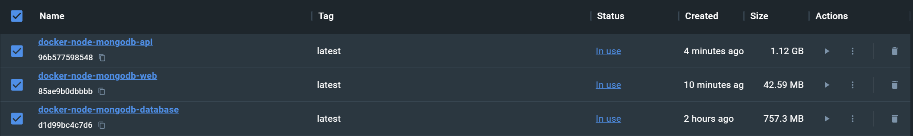
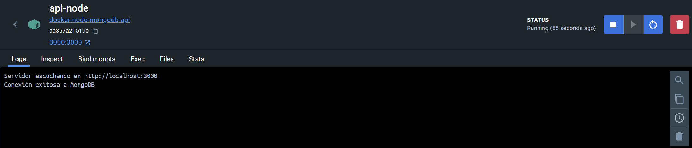
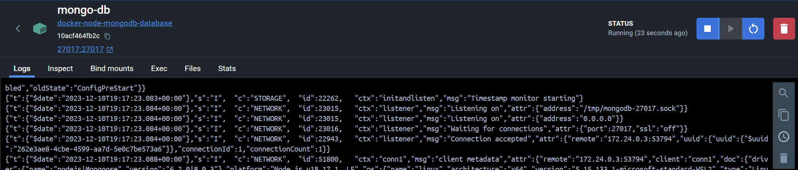
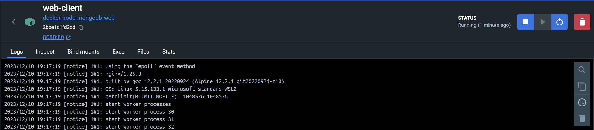

# Lista de Tareas

Este proyecto es una aplicación web de lista de tareas, que permite a los usuarios crear, visualizar, modificar y
eliminar tareas. Esta aplicación utiliza Node.js y Express para el backend, MongoDB como base de datos, y
HTML/CSS/JavaScript para el frontend. Además, utiliza Docker para la contenerización de la aplicación y su despliegue.

## Características

- Creación, visualización, actualización y eliminación de tareas.
- Interfaz de usuario sencilla y fácil de usar.
- Contenerización completa utilizando Docker.

## Estructura del Proyecto

- **`app.js`**: Archivo principal del servidor Node.js.
- **`index.html`**: Página principal del frontend.
- **`Dockerfile`**(para cada servicio): Define cómo construir cada contenedor.
- **`docker-compose.yaml`**: Configura los servicios necesarios para ejecutar la aplicación.
- **`init.js`**: Script de inicialización para la base de datos MongoDB.
- **`package.json`**: Archivo de configuración de Node.js.
- **`package-lock.json`**: Archivo de configuración de Node.js.

# Endpoints de la Aplicación Lista de Tareas

Esta tabla proporciona una descripción de los endpoints disponibles en la aplicación Lista de Tareas.

| Método | Endpoint      | Descripción                              | Cuerpo de la Petición                                                                        | Respuesta Esperada                  |
|--------|---------------|------------------------------------------|----------------------------------------------------------------------------------------------|-------------------------------------|
| GET    | `/tareas`     | Obtiene todas las tareas.                | N/A                                                                                          | Lista de todas las tareas.          |
| GET    | `/tareas/:id` | Obtiene una tarea específica por su ID.  | N/A                                                                                          | Detalles de la tarea específica.    |
| POST   | `/tareas`     | Crea una nueva tarea.                    | `{ "titulo": "Título", "description": "Descripción" }`                                       | Detalles de la tarea creada.        |
| PUT    | `/tareas/:id` | Actualiza una tarea existente por su ID. | `{ "titulo": "Nuevo Título", "description": "Nueva Descripción", "completada": true/false }` | Detalles de la tarea actualizada.   |
| DELETE | `/tareas/:id` | Elimina una tarea específica por su ID.  | N/A                                                                                          | Confirmación de la tarea eliminada. |

Cada endpoint interactúa con la base de datos MongoDB para realizar las operaciones CRUD (Crear, Leer, Actualizar,
Eliminar) en las tareas.

## Contenedores de la Aplicación Lista de Tareas
Esta aplicación utiliza tres contenedores de Docker para ejecutar la aplicación.


## Contenedor de api

El contenedor de la API contiene el código de la aplicación Node.js y se ejecuta en el puerto 3000.



## Contenedor de MongoDB

El contenedor de MongoDB contiene la base de datos MongoDB y se ejecuta en el puerto 27017.


## Contenedor de web

El contenedor web contiene el código HTML/CSS/JavaScript de la aplicación frontend y se ejecuta en el puerto 8080.



## Requisitos Previos

Para ejecutar este proyecto, necesitarás tener instalado Docker y Docker Compose en tu máquina. Si no tienes Docker
instalado, puedes descargarlo de [Docker](https://www.docker.com/products/docker-desktop).

## Instalación y Ejecución

1. Clona el repositorio:
   ```bash
   git clone https://github.com/Binweiwang/Docker-Node-Mongodb.git
   cd Docker-Node-Mongodb
   ```
   
2. Construye la imagen de Docker:
   ```bash
    docker-compose docker-compose.yaml build
    ```

Una vez que los contenedores estén en ejecución, la aplicación estará disponible.

## Uso

- Abre tu navegador y ve a http://localhost:8080.
- Utiliza la interfaz para agregar, completar o eliminar tareas.

Gracias por leer este README. Espero que hayas disfrutado de este proyecto.